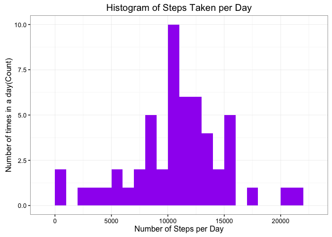
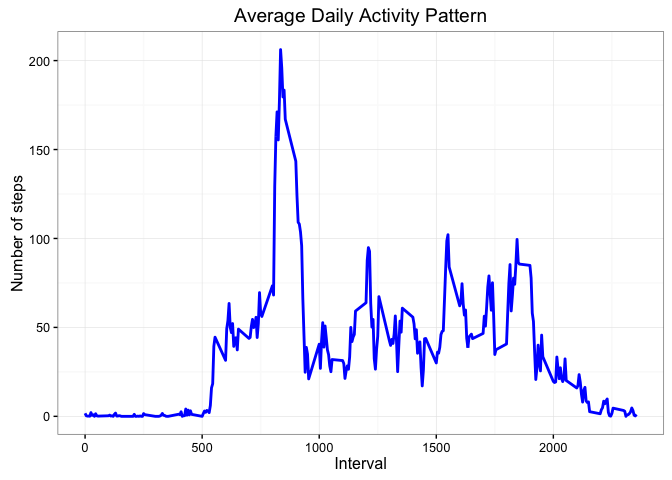
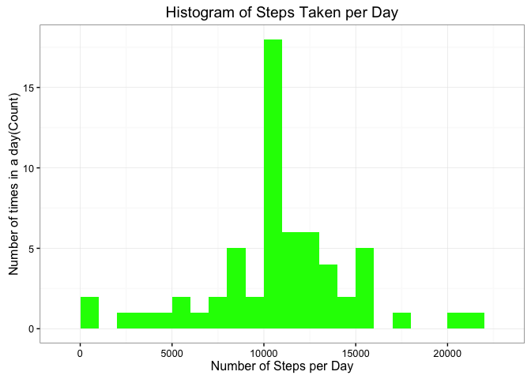
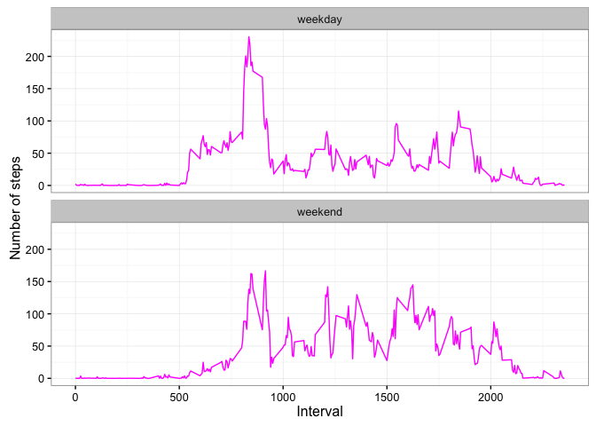

# Reproducible Research: Peer Assessment 1

## Introduction
This assignment makes use of data from a personal activity monitoring device. This device collects data at 5 minute intervals through out the day. The data consists of two months of data from an anonymous individual collected during the months of October and November, 2012 and include the number of steps taken in 5 minute intervals each day.

### Prepare the R environment

Set **echo = TRUE** so that it will be easy to read the code. 


```r
setwd("~/RepData_PeerAssessment1")
library(knitr)
opts_chunk$set(echo = TRUE, results = 'hold',fig.path = 'figure/')
```

### Load required libraries

```r
library(ggplot2)
```

### Loading and preprocessing the data

The section beloe shows code that is needed to loading and preprocessing the data into two steps: 

1. Load the data (i.e. 𝚛𝚎𝚊𝚍.𝚌𝚜𝚟())
2. Process/transform the data (if necessary) into a format suitable for analysis

### The following statement is used to load the data using `read.csv()`. It is assumed that the file activity.csv is in the current working directory.


```r
if(!file.exists('activity.csv')){
    unzip('activity.zip')
}
rdata <- read.csv('activity.csv', header = TRUE, sep = ",",
                  colClasses=c("numeric", "character", "numeric"))
```

### Preprocess the data by converting the date field to `Date` class and interbal field to `Factor` class.


```r
rdata$date <- as.Date(rdata$date, format = "%Y-%m-%d")
rdata$interval <- as.factor(rdata$interval)
```

Validate data by using `str()` method:


```r
str(rdata)
```

```
## 'data.frame':	17568 obs. of  3 variables:
##  $ steps   : num  NA NA NA NA NA NA NA NA NA NA ...
##  $ date    : Date, format: "2012-10-01" "2012-10-01" ...
##  $ interval: Factor w/ 288 levels "0","5","10","15",..: 1 2 3 4 5 6 7 8 9 10 ...
```

## What is mean total number of steps taken per day?

Ignore the missing value and calculate the total steps per day.


```r
steps_per_day <- aggregate(steps ~ date, rdata, sum)
colnames(steps_per_day) <- c("date","steps")
head(steps_per_day)
```

```
##         date steps
## 1 2012-10-02   126
## 2 2012-10-03 11352
## 3 2012-10-04 12116
## 4 2012-10-05 13294
## 5 2012-10-06 15420
## 6 2012-10-07 11015
```

1. Plot a histogram of the total number of steps taken per day with appropriate interval.


```r
ggplot(steps_per_day, aes(x = steps)) + 
       geom_histogram(fill = "purple", binwidth = 1000) + 
        labs(title="Histogram of Steps Taken per Day", 
             x = "Number of Steps per Day", y = "Number of times in a day(Count)") + theme_bw() 
```

\

2. Calculate the Mean and Median of the number of steps taken per day.


```r
steps_mean   <- mean(steps_per_day$steps, na.rm=TRUE)
steps_median <- median(steps_per_day$steps, na.rm=TRUE)
```

The mean is **10766.189** and median is **10765**.

## What is the average daily activity pattern?

Calculate the aggregate of steps by intervals of 5-minutes and convert the intervals as integers and save them in a data frame called `steps_per_interval`.


```r
steps_per_interval <- aggregate(rdata$steps, 
                                by = list(interval = rdata$interval),
                                FUN=mean, na.rm=TRUE)
steps_per_interval$interval <- 
        as.integer(levels(steps_per_interval$interval)[steps_per_interval$interval])
colnames(steps_per_interval) <- c("interval", "steps")
```


1. Plot with the time series of the average number of steps taken (averaged across all days) versus the 5-minute intervals:


```r
ggplot(steps_per_interval, aes(x=interval, y=steps)) +   
        geom_line(color="blue", size=1) +  
        labs(title="Average Daily Activity Pattern", x="Interval", y="Number of steps") +  
        theme_bw()
```

\


2. Find the 5-minute interval with the containing the maximum number of steps:


```r
max_interval <- steps_per_interval[which.max(  
        steps_per_interval$steps),]
```

The **835<sup>th</sup>** interval has maximum **206** steps.

## Imputing missing values

The total number of missing values in steps can be calculated using `is.na()` method to check if the value is mising or not and then summing the logical vector.


```r
missing_vals <- sum(is.na(rdata$steps))
```

The total number of ***missing values*** are **2304**.

Replace missing values with the mean value at the same interval across days. Now create a function `na_fill(data, pervalue)` which the `data` arguement is the `rdata` data frame and `pervalue` arguement is the `steps_per_interval` data frame.


```r
na_fill <- function(data, pervalue) {
        na_index <- which(is.na(data$steps))
        na_replace <- unlist(lapply(na_index, FUN=function(idx){
                interval = data[idx,]$interval
                pervalue[pervalue$interval == interval,]$steps
        }))
        fill_steps <- data$steps
        fill_steps[na_index] <- na_replace
        fill_steps
}

rdata_fill <- data.frame(  
        steps = na_fill(rdata, steps_per_interval),  
        date = rdata$date,  
        interval = rdata$interval)
str(rdata_fill)
```

```
## 'data.frame':	17568 obs. of  3 variables:
##  $ steps   : num  1.717 0.3396 0.1321 0.1509 0.0755 ...
##  $ date    : Date, format: "2012-10-01" "2012-10-01" ...
##  $ interval: Factor w/ 288 levels "0","5","10","15",..: 1 2 3 4 5 6 7 8 9 10 ...
```

Check if there any missing values remaining or not


```r
sum(is.na(rdata_fill$steps))
```

```
## [1] 0
```

***Zero*** output shows that there are no missing values.

Plot a histogram of the daily total number of steps taken, plotted with a bin interval of 1000 steps, after filling missing values.


```r
fill_steps_per_day <- aggregate(steps ~ date, rdata_fill, sum)
colnames(fill_steps_per_day) <- c("date","steps")

ggplot(fill_steps_per_day, aes(x = steps)) + 
       geom_histogram(fill = "green", binwidth = 1000) + 
        labs(title="Histogram of Steps Taken per Day", 
             x = "Number of Steps per Day", y = "Number of times in a day(Count)") + theme_bw() 
```

\

Calculate and report the **mean** and **median** total number of steps taken per day.


```r
steps_mean_fill   <- mean(fill_steps_per_day$steps, na.rm=TRUE)
steps_median_fill <- median(fill_steps_per_day$steps, na.rm=TRUE)
```

The mean is **10766.189** and median is **10766.189**.

### Do these values differ from the estimates from the first part of the assignment?

Yes, these values do differ slightly.

- **Before filling the data**
    1. Mean  : **10766.189**
    2. Median: **10765**
    
    
- **After filling the data**
    1. Mean  : **10766.189**
    2. Median: **10766.189**

We see that the values after filling the data mean and median are equal.

### What is the impact of imputing missing data on the estimates of the total daily number of steps?

Comparing with the calculations done in the first section of this document, we observe that while the mean value remains unchanged, the median value has shifted and virtual matches to the mean.  

Since our data has shown a t-student distribution (see both histograms), it seems that the impact of imputing missing values has increase our peak, but it's not affect negatively our predictions. 

## Are there differences in activity patterns between weekdays and weekends?
Compare the table with filled-in missing values. First, augment the table with a column that indicates the day of the week. Second, subset the table into two parts - weekends (Saturday and Sunday) and weekdays (Monday through Friday). Next,tabulate the average steps per interval for each data set. FInally, Plot the two data sets side by side for comparison.  


```r
weekdays_steps <- function(data) {
    weekdays_steps <- aggregate(data$steps, by=list(interval = data$interval),
                          FUN=mean, na.rm=T)
    # convert to integers for plotting
    weekdays_steps$interval <- 
            as.integer(levels(weekdays_steps$interval)[weekdays_steps$interval])
    colnames(weekdays_steps) <- c("interval", "steps")
    weekdays_steps
}

data_by_weekdays <- function(data) {
    data$weekday <- 
            as.factor(weekdays(data$date)) # weekdays
    weekend_data <- subset(data, weekday %in% c("Saturday","Sunday"))
    weekday_data <- subset(data, !weekday %in% c("Saturday","Sunday"))
    
    weekend_steps <- weekdays_steps(weekend_data)
    weekday_steps <- weekdays_steps(weekday_data)
    
    weekend_steps$dayofweek <- rep("weekend", nrow(weekend_steps))
    weekday_steps$dayofweek <- rep("weekday", nrow(weekday_steps))
    
    data_by_weekdays <- rbind(weekend_steps, weekday_steps)
    data_by_weekdays$dayofweek <- as.factor(data_by_weekdays$dayofweek)
    data_by_weekdays
}

data_weekdays <- data_by_weekdays(rdata_fill)
```

Plot comparing the average number of steps taken per 5-minute interval across weekdays and weekends:

```r
ggplot(data_weekdays, aes(x=interval, y=steps)) + 
        geom_line(color="magenta") + 
        facet_wrap(~ dayofweek, nrow=2, ncol=1) +
        labs(x="Interval", y="Number of steps") +
        theme_bw()
```

\

Graph above depicts activity on the weekday has the greatest peak from all steps intervals. But, weekends activities has more peaks over a hundred than weekday. On weekends we can see better distribution of effort along the time.
